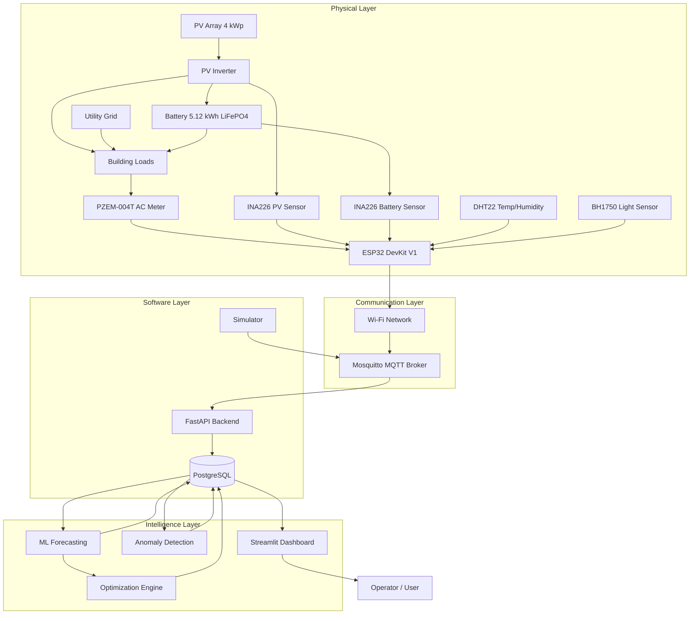
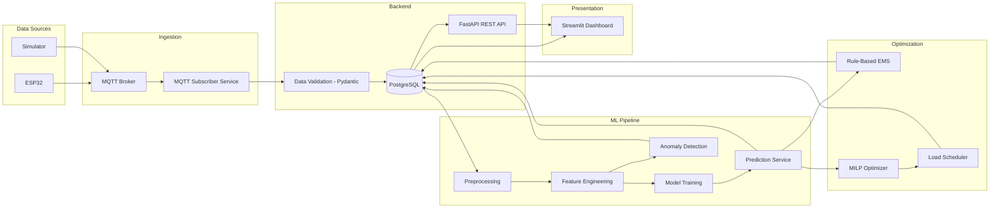

# PROJECT DESIGN DOCUMENT

## AI-Based Smart Energy Management System for a Solar-Powered Building

**Author:** Mehdi  
**University:** Université Ibn Tofaïl — Kénitra, Morocco  
**Program:** Master's in Renewable Energy & Green Hydrogen  
**Date:** August 2026  
**Version:** 1.0  

---

## Table of Contents

1. [Project Title](#1-project-title)
2. [Problem Statement](#2-problem-statement)
3. [Motivation](#3-motivation)
4. [Main Objectives](#4-main-objectives)
5. [Secondary Objectives](#5-secondary-objectives)
6. [Functional Requirements](#6-functional-requirements)
7. [Non-Functional Requirements](#7-non-functional-requirements)
8. [Proposed Architecture](#8-proposed-architecture)
9. [Hardware Architecture](#9-hardware-architecture)
10. [Software Architecture](#10-software-architecture)
11. [AI Architecture](#11-ai-architecture)
12. [Energy-Flow Model](#12-energy-flow-model)
13. [Battery Model](#13-battery-model)
14. [Optimization Strategy](#14-optimization-strategy)
15. [Data Architecture](#15-data-architecture)
16. [Communication Architecture](#16-communication-architecture)
17. [Dashboard Concept](#17-dashboard-concept)
18. [Simulation Strategy](#18-simulation-strategy)
19. [Testing Strategy](#19-testing-strategy)
20. [Required Components](#20-required-components)
21. [Estimated Component Costs (BOM)](#21-estimated-component-costs-bom)
22. [Development Timeline](#22-development-timeline)
23. [Expected Results](#23-expected-results)
24. [Main Risks](#24-main-risks)
25. [Safety Considerations](#25-safety-considerations)
26. [Future Improvements](#26-future-improvements)
27. [GitHub Project Structure](#27-github-project-structure)
28. [Diagrams](#28-diagrams)

---

## 1. Project Title

**AI-Based Smart Energy Management System for a Solar-Powered Building**

Full designation: Design and implementation of an intelligent energy management system combining photovoltaic generation, battery storage, IoT monitoring, machine learning forecasting, and optimization-based dispatch for a small solar-powered building.

---

## 2. Problem Statement

Small buildings with rooftop PV installations and battery storage in Morocco face several energy management challenges:

- **No visibility** into real-time energy flows — occupants cannot see how much PV energy is being consumed, stored, or wasted.
- **Reactive grid usage** — without forecasting, the system draws from the grid at peak tariff hours even when PV surplus was available earlier.
- **Poor self-consumption** — without load scheduling, PV generation and consumption peaks are misaligned. A typical residential PV system without storage or load management achieves only 30–40% self-consumption.
- **Battery underutilization** — without state-aware control, batteries charge and discharge inefficiently, shortening lifetime and missing economic value.
- **No anomaly awareness** — faults, appliance malfunctions, or abnormal consumption patterns go undetected until the electricity bill arrives.
- **No data-driven decisions** — building operators have no quantitative basis for adjusting behavior or equipment schedules.

There is no affordable, integrated, open-source system that combines real-time metering, storage management, ML forecasting, and optimization dispatch for small buildings in the Moroccan context.

---

## 3. Motivation

- **Academic:** Integrates renewable energy engineering, electrical engineering, IoT, databases, AI/ML, and optimization into a single coherent project — ideal for a Master's PFE.
- **Technical:** Demonstrates measurable energy and cost improvements through AI-assisted dispatch vs. conventional rule-based operation.
- **Economic:** Morocco's electricity tariffs make PV self-consumption financially attractive; intelligent management increases the return on PV+battery investment.
- **Environmental:** Reducing grid imports directly reduces CO₂ emissions from Morocco's fossil-heavy generation mix.
- **Professional:** The project produces a deployable GitHub portfolio piece with hardware, firmware, backend, ML, and dashboard components.

---

## 4. Main Objectives

| # | Objective |
|---|-----------|
| O1 | Measure building electrical consumption and PV production in real time using ESP32 + sensors |
| O2 | Monitor battery state of charge (SOC) and energy flows |
| O3 | Store all measurements in a time-series database |
| O4 | Build ML models that forecast next-day energy consumption (MAE, RMSE, MAPE, R² reported) |
| O5 | Build ML models that forecast next-day PV production |
| O6 | Detect anomalous energy consumption events |
| O7 | Implement an optimization-based Energy Management System (EMS) that schedules battery dispatch and flexible loads |
| O8 | Compare baseline (no optimization) vs. intelligent EMS on: grid imports, self-consumption, cost, and CO₂ |
| O9 | Display all data, forecasts, and optimization results on a professional dashboard |

---

## 5. Secondary Objectives

| # | Objective |
|---|-----------|
| S1 | Calculate economic metrics: daily/monthly/annual cost, estimated payback |
| S2 | Calculate environmental metrics: CO₂ avoided |
| S3 | Provide operator recommendations based on optimization output |
| S4 | Build a simulation environment that generates realistic synthetic data for testing without hardware |
| S5 | Containerize the software stack with Docker for reproducible deployment |
| S6 | Produce a LaTeX technical report suitable for university submission |

---

## 6. Functional Requirements

| ID | Requirement | Priority |
|----|-------------|----------|
| FR-01 | System measures AC voltage, current, power, energy, and power factor at the building main panel | Must |
| FR-02 | System measures PV DC voltage, current, and power | Must |
| FR-03 | System reads battery voltage, current, and derives SOC | Must |
| FR-04 | System reads ambient temperature and humidity | Should |
| FR-05 | System reads solar irradiance (pyranometer or proxy) | Could |
| FR-06 | ESP32 publishes all measurements via MQTT over Wi-Fi at ≤ 15 s intervals | Must |
| FR-07 | Python backend subscribes to MQTT, validates, and stores data in PostgreSQL | Must |
| FR-08 | Dashboard displays real-time PV power, load power, battery SOC, grid power | Must |
| FR-09 | Dashboard displays historical time-series with selectable range | Must |
| FR-10 | ML module forecasts next-day hourly energy consumption | Must |
| FR-11 | ML module forecasts next-day PV production | Should |
| FR-12 | Anomaly detection module flags unusual consumption events and generates alerts | Must |
| FR-13 | Optimization engine generates hourly battery dispatch and flexible-load schedule for the next day | Must |
| FR-14 | Dashboard shows forecast vs. actual, optimization schedule, and performance comparison | Must |
| FR-15 | Simulation module generates synthetic PV, load, and weather profiles for any scenario | Must |
| FR-16 | System operates identically on simulated and real sensor data | Must |

---

## 7. Non-Functional Requirements

| ID | Requirement | Target |
|----|-------------|--------|
| NF-01 | Measurement latency (sensor → database) | < 5 s |
| NF-02 | Dashboard refresh rate | ≤ 10 s for real-time page |
| NF-03 | Forecast computation time (24 h horizon) | < 30 s |
| NF-04 | Optimization computation time (24 h horizon) | < 60 s |
| NF-05 | System uptime (software components) | > 99% during testing |
| NF-06 | Graceful degradation on Wi-Fi/MQTT/sensor failure | Required |
| NF-07 | No hard-coded credentials in source code | Required |
| NF-08 | MQTT broker requires username/password | Required |
| NF-09 | PEP 8 compliance for Python code | Required |
| NF-10 | All code type-hinted and documented | Required |
| NF-11 | Reproducible results (fixed random seeds, version-pinned dependencies) | Required |

---

## 8. Proposed Architecture

The system is organized into three layers:

### Layer 1 — Physical Prototype

ESP32 microcontroller + analog/digital sensors + energy meters. Handles real-time electrical and environmental measurement. Communicates over Wi-Fi.

### Layer 2 — Digital / Software Layer

MQTT broker (Mosquitto) + Python backend (FastAPI) + PostgreSQL database + data preprocessing pipeline. Handles data ingestion, validation, storage, and API exposure.

### Layer 3 — Intelligence Layer

ML forecasting (consumption + PV) + anomaly detection + optimization engine (LP/MILP) + dashboard (Streamlit). Handles prediction, decision-making, and visualization.

**Data flow (simplified):**

```
Sensors/Meters → ESP32 → Wi-Fi/MQTT → Mosquitto Broker
                                            ↓
                                     Python Backend (FastAPI)
                                            ↓
                                     PostgreSQL Database
                                        ↓         ↓
                              ML Pipeline    Optimization Engine
                                   ↓                ↓
                              Forecasts        Dispatch Schedule
                                   ↓                ↓
                                  Streamlit Dashboard
                                        ↓
                                  Operator / User
```

The simulation module can replace ESP32 input at the MQTT level, making the rest of the stack hardware-agnostic.

---

## 9. Hardware Architecture

### 9.1 Measurement Points

| Point | What is measured | Method |
|-------|-----------------|--------|
| Building main panel | V, I, P, Q, S, PF, f, E | Commercial energy meter (e.g., PZEM-004T v3) via TTL to ESP32 |
| PV output (DC side of inverter, or AC side) | V_pv, I_pv, P_pv | INA226 DC sensor module or second PZEM on AC side |
| Battery | V_bat, I_bat | INA226 high-side current/voltage sensor |
| Environment | Temperature, humidity | DHT22 or SHT30 |
| Environment | Solar irradiance (optional) | BH1750 lux sensor as proxy, or commercial pyranometer |

### 9.2 ESP32 Block Diagram

```
+----------------+       UART        +------------+
|  PZEM-004T v3  |  ───────────────> |            |
| (AC load meter)|                   |            |
+----------------+                   |            |       Wi-Fi
                                     |   ESP32    | ──────────────> MQTT Broker
+----------------+       I²C        |  DevKit V1 |
|   INA226 #1    |  ───────────────> |            |
| (PV DC meter)  |                   |            |
+----------------+                   |            |
                                     |            |
+----------------+       I²C        |            |
|   INA226 #2    |  ───────────────> |            |
| (Battery meter)|                   |            |
+----------------+                   |            |
                                     |            |
+----------------+   Digital/I²C     |            |
|  DHT22 / SHT30 |  ───────────────> |            |
| (Temp/Humidity)|                   |            |
+----------------+                   +------------+
                                          |
+----------------+       I²C             |
|    BH1750      |  ─────────────────────+
| (Light/Lux)    |
+----------------+
```

### 9.3 Power Supply

- ESP32 powered via USB 5 V from a phone charger or USB adapter.
- Sensors powered from ESP32 3.3 V rail (INA226, DHT22, BH1750) or 5 V (PZEM-004T).
- **No mains voltage on the breadboard.** The PZEM-004T handles mains isolation internally via its current transformer (CT clamp) and isolated voltage input.

### 9.4 Safety Boundary

The ESP32 and breadboard operate exclusively at 3.3–5 V DC. All mains-voltage measurement is handled inside the PZEM-004T module, which provides galvanic isolation. The CT clamp clips around a wire without breaking the circuit.

---

## 10. Software Architecture

```
smart-energy-management/
│
├── firmware/esp32/          # PlatformIO project (C++)
│   ├── src/main.cpp
│   ├── src/config.h
│   ├── src/sensors/
│   ├── src/communication/
│   └── platformio.ini
│
├── backend/                 # Python FastAPI
│   ├── app/
│   │   ├── main.py          # FastAPI app entry
│   │   ├── config.py        # Settings from .env
│   │   ├── database.py      # SQLAlchemy engine/session
│   │   ├── models/          # ORM models
│   │   ├── schemas/         # Pydantic schemas
│   │   ├── api/             # REST endpoints
│   │   ├── services/        # MQTT subscriber, data ingestion
│   │   └── utils/           # Logging, validation helpers
│   ├── tests/
│   └── requirements.txt
│
├── ml/                      # Machine learning pipeline
│   ├── data/                # Raw + processed datasets
│   ├── preprocessing/       # Feature engineering scripts
│   ├── forecasting/         # Consumption + PV forecast models
│   ├── anomaly_detection/   # Anomaly detection module
│   └── models/              # Saved model artifacts (.joblib)
│
├── optimization/            # EMS optimization engine
│   ├── rule_based.py
│   ├── milp_optimizer.py
│   └── load_scheduler.py
│
├── simulation/              # Synthetic data generator
│   ├── profiles/            # Load/PV/weather profile configs
│   ├── simulator.py
│   └── scenarios.py
│
├── dashboard/               # Streamlit app
│   ├── app.py
│   ├── pages/
│   └── components/
│
├── database/                # SQL schemas, migrations
│   └── schema.sql
│
├── config/                  # Shared configuration
│   └── settings.yaml
│
├── docker/
│   ├── Dockerfile.backend
│   ├── Dockerfile.dashboard
│   └── mosquitto.conf
│
├── notebooks/               # Exploratory analysis
├── tests/                   # Integration tests
├── docs/                    # Architecture docs, diagrams
│
├── docker-compose.yml
├── requirements.txt
├── .env.example
├── .gitignore
└── README.md
```

### Technology Stack

| Layer | Technology | Justification |
|-------|-----------|---------------|
| Microcontroller | ESP32 DevKit V1 | Wi-Fi built-in, dual-core, sufficient ADC/I²C/UART, large community, PlatformIO support |
| Firmware framework | Arduino framework on PlatformIO | Simpler sensor libraries than ESP-IDF; PlatformIO provides proper dependency management |
| Communication | MQTT v3.1.1 (Mosquitto) | Lightweight pub/sub, standard for IoT, low overhead, persistent sessions |
| Backend | Python 3.11 + FastAPI | Async support, Pydantic validation, automatic OpenAPI docs |
| ORM | SQLAlchemy 2.x | Mature, supports PostgreSQL and SQLite interchangeably |
| Database | PostgreSQL 15 (prod), SQLite (dev) | PostgreSQL handles concurrent writes and time-series indexing well |
| ML | scikit-learn, XGBoost, pandas, numpy | Proven libraries; no unnecessary deep learning complexity |
| Optimization | PuLP (CBC solver) | Free, well-documented LP/MILP solver; sufficient for 24-hour horizon with 15 min steps |
| Dashboard | Streamlit | Fast prototyping, native Python, built-in charting, no JS required |
| Containers | Docker + docker-compose | Reproducible deployment of broker, database, backend, dashboard |

---

## 11. AI Architecture

### 11.1 Consumption Forecasting Pipeline

```
Raw measurements (15 min intervals)
        ↓
Preprocessing: missing data → interpolation, outlier removal, resampling
        ↓
Feature engineering:
  - hour, day_of_week, month, is_weekend
  - lag features: P_load(t-1), P_load(t-24h), P_load(t-7d)
  - rolling stats: mean_24h, std_24h
  - temperature, irradiance
        ↓
Train/Validation/Test split (chronological, no shuffle)
  - Train: first 70% of time series
  - Validation: next 15%
  - Test: final 15%
        ↓
Models trained:
  1. Naive baseline (same hour previous week)
  2. Linear Regression
  3. Random Forest
  4. XGBoost (primary candidate)
        ↓
Evaluation: MAE, RMSE, MAPE, R²
        ↓
Best model selected → saved as .joblib
        ↓
Inference: predict next 24 h of hourly consumption
```

### 11.2 PV Production Forecasting Pipeline

Same structure as above, with different features:

- Inputs: irradiance, temperature, hour, day_of_year, cloud proxy (irradiance variability)
- Target: P_pv(t) at 15-minute or hourly resolution
- Models: same candidates (Linear Regression, Random Forest, XGBoost)

### 11.3 Anomaly Detection Pipeline

```
Historical consumption data
        ↓
Method 1 — Statistical thresholds:
  - Per-hour rolling mean ± k × std (k = 2.5 or 3)
  - Flag if consumption > threshold
        ↓
Method 2 — Isolation Forest:
  - Features: hour, day_of_week, P_load, temperature
  - contamination parameter tuned on labeled subset
        ↓
Compare precision/recall of both methods
        ↓
Generate alerts with timestamp + severity + context
```

### 11.4 Key Constraints

- No data leakage: future values never used as features.
- Reproducibility: `random_state=42` everywhere.
- Clearly labeled: synthetic data never presented as real measurements.
- Baseline comparison mandatory for every model.

---

## 12. Energy-Flow Model

### Energy Balance Equation

At every time step *t* (Δt = 15 min = 0.25 h):

```
P_pv(t) + P_grid(t) + P_bat_discharge(t) = P_load(t) + P_bat_charge(t) + P_losses(t)
```

Where:

| Variable | Unit | Description |
|----------|------|-------------|
| P_pv(t) | W | PV array output power (AC side of inverter) |
| P_grid(t) | W | Power imported from the grid (≥ 0; no export assumed initially) |
| P_bat_discharge(t) | W | Battery discharging power (≥ 0) |
| P_load(t) | W | Total building load |
| P_bat_charge(t) | W | Battery charging power (≥ 0) |
| P_losses(t) | W | Inverter + wiring losses, modeled as fixed percentage (2–5% of throughput) |

### Energy Conversion

Energy during interval Δt:

```
E(t) = P(t) × Δt
```

With Δt = 0.25 h, a power of 2000 W corresponds to 500 Wh = 0.5 kWh per interval.

### PV Power Model (for simulation)

```
P_pv(t) = P_pv_peak × (G(t) / G_STC) × (1 + γ × (T_cell(t) - T_STC))
```

Where:

- P_pv_peak = rated PV capacity (W)
- G(t) = irradiance at time t (W/m²)
- G_STC = 1000 W/m²
- γ = temperature coefficient ≈ −0.004 /°C for crystalline silicon
- T_cell(t) = cell temperature ≈ T_ambient + 0.03 × G(t) (simplified NOCT model)
- T_STC = 25 °C

### Grid Power

Derived from the balance:

```
P_grid(t) = P_load(t) + P_bat_charge(t) + P_losses(t) - P_pv(t) - P_bat_discharge(t)
```

Constrained: P_grid(t) ≥ 0 (no grid export in the initial model).

---

## 13. Battery Model

### Specifications (reference system)

| Parameter | Value | Justification |
|-----------|-------|---------------|
| Nominal capacity (E_bat) | 5.12 kWh | Common LiFePO4 48V/100Ah module |
| Nominal voltage | 48 V DC | Standard for residential storage |
| SOC_min | 10% | Protect against deep discharge |
| SOC_max | 95% | Protect against overcharge |
| Max charge power (P_ch_max) | 2500 W | 0.5C rate |
| Max discharge power (P_dis_max) | 2500 W | 0.5C rate |
| Charging efficiency (η_ch) | 95% | Typical for LiFePO4 |
| Discharging efficiency (η_dis) | 95% | Typical for LiFePO4 |
| Cycle life | ~4000 cycles at 80% DoD | LiFePO4 specification |

### State of Charge Model

**Charging:**

```
SOC(t+1) = SOC(t) + (η_ch × P_bat_charge(t) × Δt) / E_bat
```

**Discharging:**

```
SOC(t+1) = SOC(t) - (P_bat_discharge(t) × Δt) / (η_dis × E_bat)
```

### Constraints

```
SOC_min ≤ SOC(t) ≤ SOC_max       ∀ t
0 ≤ P_bat_charge(t) ≤ P_ch_max   ∀ t
0 ≤ P_bat_discharge(t) ≤ P_dis_max  ∀ t
P_bat_charge(t) × P_bat_discharge(t) = 0   ∀ t   (no simultaneous charge/discharge)
```

The last constraint is nonlinear. In the MILP formulation, it is linearized using a binary variable:

```
P_bat_charge(t) ≤ P_ch_max × z(t)
P_bat_discharge(t) ≤ P_dis_max × (1 - z(t))
```

Where z(t) ∈ {0, 1}: z=1 → charging mode, z=0 → discharging mode.

### Battery Degradation Cost (simplified)

```
C_deg(t) = (P_bat_discharge(t) × Δt) / (2 × E_bat × N_cycles) × C_battery_replacement
```

This penalizes unnecessary cycling.

---

## 14. Optimization Strategy

### Objective Function

Minimize total daily operating cost over a 24-hour horizon (96 time steps at 15-min resolution):

```
min Σ_t [ C_grid(t) × P_grid(t) × Δt
        + C_deg(t)
        + λ_peak × max(P_grid)
        + λ_comfort × Σ_j (penalty if critical load j is unserved) ]
```

Where:

- C_grid(t) = electricity tariff at time t (MAD/kWh) — potentially time-of-use
- C_deg(t) = battery degradation cost
- λ_peak = peak demand penalty coefficient
- λ_comfort = comfort violation penalty

### Subject to

1. Energy balance at every t
2. Battery SOC constraints
3. Battery power limits
4. No simultaneous charge/discharge
5. Grid power ≥ 0
6. Flexible load scheduling constraints (see below)
7. Critical loads always served (soft constraint via penalty)

### Flexible Load Constraints

For each flexible load *j*:

```
Σ_t (x_j(t) × Δt) = E_j_required        (total energy requirement met)
x_j(t) ∈ {0, 1}                          (on or off per interval)
x_j(t) = 0  for t ∉ [t_start_j, t_end_j]  (allowed time window)
```

Where x_j(t) is a binary decision variable and E_j_required is the energy the load needs.

### Two Strategies Compared

**Strategy A — Rule-Based EMS:**

```python
if P_pv > P_load:
    surplus = P_pv - P_load
    if SOC < SOC_max:
        charge battery with min(surplus, P_ch_max)
    else:
        curtail PV (or export if allowed)
elif P_pv < P_load:
    deficit = P_load - P_pv
    if SOC > SOC_min:
        discharge battery with min(deficit, P_dis_max)
    else:
        import from grid
```

No forecasting, no load shifting, purely reactive.

**Strategy B — MILP-Based EMS:**

Uses PuLP with CBC solver. Takes as input:
- Forecasted consumption (from ML model)
- Forecasted PV production (from ML model)
- Battery state
- Tariff schedule
- Flexible load definitions

Outputs:
- Hourly battery charge/discharge schedule
- Flexible load start times
- Expected grid import profile
- Expected cost

---

## 15. Data Architecture

### Database: PostgreSQL

### Tables

**devices**

| Column | Type | Description |
|--------|------|-------------|
| device_id | UUID PK | Unique device identifier |
| name | VARCHAR(100) | Human-readable name |
| type | VARCHAR(50) | "esp32", "simulator" |
| location | VARCHAR(100) | Installation location |
| created_at | TIMESTAMPTZ | Registration time |

**measurements**

| Column | Type | Description |
|--------|------|-------------|
| id | BIGSERIAL PK | Auto-increment |
| device_id | UUID FK → devices | Source device |
| timestamp | TIMESTAMPTZ | Measurement time (indexed) |
| voltage_v | FLOAT | Grid voltage (V) |
| current_a | FLOAT | Grid current (A) |
| power_w | FLOAT | Active power (W) |
| energy_kwh | FLOAT | Cumulative energy (kWh) |
| power_factor | FLOAT | Power factor |
| frequency_hz | FLOAT | Grid frequency (Hz) |

**pv_measurements**

| Column | Type | Description |
|--------|------|-------------|
| id | BIGSERIAL PK | |
| device_id | UUID FK | |
| timestamp | TIMESTAMPTZ | Indexed |
| pv_voltage_v | FLOAT | PV voltage (V) |
| pv_current_a | FLOAT | PV current (A) |
| pv_power_w | FLOAT | PV power (W) |

**battery_status**

| Column | Type | Description |
|--------|------|-------------|
| id | BIGSERIAL PK | |
| device_id | UUID FK | |
| timestamp | TIMESTAMPTZ | Indexed |
| voltage_v | FLOAT | Battery terminal voltage |
| current_a | FLOAT | Positive = charging |
| power_w | FLOAT | |
| soc_percent | FLOAT | State of charge (%) |

**environmental_data**

| Column | Type | Description |
|--------|------|-------------|
| id | BIGSERIAL PK | |
| device_id | UUID FK | |
| timestamp | TIMESTAMPTZ | Indexed |
| temperature_c | FLOAT | Ambient temperature (°C) |
| humidity_percent | FLOAT | Relative humidity (%) |
| irradiance_wm2 | FLOAT | Solar irradiance (W/m²), nullable |

**predictions**

| Column | Type | Description |
|--------|------|-------------|
| id | BIGSERIAL PK | |
| timestamp | TIMESTAMPTZ | Prediction target time |
| created_at | TIMESTAMPTZ | When prediction was made |
| prediction_type | VARCHAR(30) | "consumption" or "pv" |
| model_name | VARCHAR(50) | "xgboost_v1" etc. |
| predicted_value_w | FLOAT | Predicted power (W) |
| actual_value_w | FLOAT | Actual (filled after fact), nullable |

**optimization_results**

| Column | Type | Description |
|--------|------|-------------|
| id | BIGSERIAL PK | |
| created_at | TIMESTAMPTZ | When optimization ran |
| horizon_start | TIMESTAMPTZ | Start of schedule |
| horizon_end | TIMESTAMPTZ | End of schedule |
| strategy | VARCHAR(20) | "rule_based" or "milp" |
| schedule_json | JSONB | Full dispatch schedule |
| expected_cost_mad | FLOAT | |
| expected_grid_kwh | FLOAT | |

**alerts**

| Column | Type | Description |
|--------|------|-------------|
| id | BIGSERIAL PK | |
| timestamp | TIMESTAMPTZ | When anomaly occurred |
| alert_type | VARCHAR(50) | "high_consumption", "night_anomaly", etc. |
| severity | VARCHAR(10) | "info", "warning", "critical" |
| message | TEXT | Human-readable description |
| acknowledged | BOOLEAN DEFAULT FALSE | |

### Indexes

- `measurements(timestamp)` — B-tree
- `measurements(device_id, timestamp)` — composite
- `pv_measurements(timestamp)` — B-tree
- `battery_status(timestamp)` — B-tree
- `predictions(timestamp, prediction_type)` — composite
- `alerts(timestamp, severity)` — composite

### Time Resolution

**15-minute intervals** chosen as the primary resolution.

Rationale:
- 1-minute: excessive storage (525,600 rows/year per sensor), minimal forecasting benefit.
- 5-minute: viable but unnecessary for a building-level system where loads change slowly.
- 15-minute: matches common utility metering intervals, sufficient for load forecasting and optimization, manageable storage (35,040 rows/year per sensor), aligns with the optimization dispatch time step.

Raw data from ESP32 (every 10–15 s) is aggregated to 15-min averages before storage.

---

## 16. Communication Architecture

### Protocol: MQTT v3.1.1

Broker: Eclipse Mosquitto (Docker container)

### Topic Structure

```
building/{device_id}/load/power        → Load active power (W)
building/{device_id}/load/energy       → Cumulative load energy (kWh)
building/{device_id}/load/voltage      → Grid voltage (V)
building/{device_id}/load/current      → Grid current (A)
building/{device_id}/load/pf           → Power factor
building/{device_id}/load/frequency    → Grid frequency (Hz)
building/{device_id}/pv/power          → PV power (W)
building/{device_id}/pv/voltage        → PV voltage (V)
building/{device_id}/pv/current        → PV current (A)
building/{device_id}/battery/voltage   → Battery voltage (V)
building/{device_id}/battery/current   → Battery current (A)
building/{device_id}/battery/soc       → Battery SOC (%)
building/{device_id}/env/temperature   → Temperature (°C)
building/{device_id}/env/humidity      → Humidity (%)
building/{device_id}/env/irradiance    → Irradiance (W/m²)
building/{device_id}/status            → Device heartbeat / status
```

### Payload Format (JSON)

```json
{
  "timestamp": "2026-09-15T14:30:00+01:00",
  "device_id": "esp32-metering-01",
  "sensor": "pzem004t",
  "values": {
    "voltage_v": 228.3,
    "current_a": 7.82,
    "power_w": 1785.0,
    "energy_kwh": 42.37,
    "power_factor": 0.98,
    "frequency_hz": 50.02
  }
}
```

### Alternative: Bundled Payload

For bandwidth efficiency, ESP32 can publish a single bundled message:

```
building/{device_id}/telemetry
```

```json
{
  "timestamp": "2026-09-15T14:30:00+01:00",
  "device_id": "esp32-metering-01",
  "load": {"voltage_v": 228.3, "current_a": 7.82, "power_w": 1785.0, "energy_kwh": 42.37, "pf": 0.98, "freq_hz": 50.02},
  "pv": {"voltage_v": 36.2, "current_a": 8.1, "power_w": 293.2},
  "battery": {"voltage_v": 51.4, "current_a": 3.2, "soc_pct": 72.0},
  "env": {"temperature_c": 34.1, "humidity_pct": 45.0, "irradiance_wm2": 820.0}
}
```

Recommendation: use the bundled format to reduce MQTT overhead. One publish per cycle.

### QoS

- Telemetry: QoS 0 (at most once) — acceptable for periodic data.
- Alerts/commands: QoS 1 (at least once).

### Security

- Mosquitto configured with `password_file` and `allow_anonymous false`.
- TLS optional for academic prototype; documented for production.

---

## 17. Dashboard Concept

### Framework: Streamlit

### Pages

| Page | Content | Update Rate |
|------|---------|-------------|
| 1. Overview | Live gauges: PV power, load power, battery SOC, grid power, energy cost today, energy flow direction arrows | 10 s |
| 2. Energy Flow | Sankey-style or arrow diagram: PV→Load, PV→Battery, Battery→Load, Grid→Load. Proportional to current power | 10 s |
| 3. Historical | Time-series plots: power, energy, SOC, PV, load. Date range selector, 15-min resolution | On demand |
| 4. Consumption Forecast | Actual vs. predicted consumption. Metrics (MAE, RMSE, MAPE). Confidence interval if available | Daily |
| 5. PV Forecast | Actual vs. predicted PV. Same structure as above | Daily |
| 6. Optimization | Recommended load schedule table. Battery dispatch chart. Expected grid import profile. Expected vs. actual cost | Daily |
| 7. Alerts | Table of anomalies: timestamp, type, severity, message. Filter by date/severity. Acknowledge button | On demand |
| 8. Performance | Side-by-side comparison: Scenario A (baseline) vs. Scenario B (optimized). Bar charts for grid kWh, cost, self-consumption %, CO₂ | On demand |

---

## 18. Simulation Strategy

### Purpose

Allow full system testing without physical hardware. The simulator must produce data indistinguishable (in format) from ESP32 sensor data.

### Architecture

The simulator publishes to the same MQTT topics as the ESP32 would. The backend does not need to know whether data is real or simulated.

### Profiles

**PV generation profile** — based on a clear-sky irradiance model for Meknès latitude (33.9°N):
- Bell-shaped curve peaking at solar noon.
- Amplitude scaled by P_pv_peak and cloud factor.
- Seasonal variation via day length and solar elevation.

**Load consumption profile** — based on typical Moroccan residential patterns:
- Baseline (refrigerator, standby): 200–400 W continuous.
- Morning peak (07:00–09:00): lighting, water heater.
- Midday low (09:00–12:00).
- Afternoon/evening peak (18:00–23:00): cooking, TV, AC, lighting.
- Night minimum (23:00–06:00).

**Weather profile:**
- Temperature: sinusoidal daily cycle, 15–40 °C depending on season.
- Irradiance: clear-sky model modulated by cloud factor (0–1).

### Predefined Scenarios

| Scenario | Cloud Factor | Load Multiplier | Season |
|----------|-------------|-----------------|--------|
| Sunny summer day | 0.0 | 1.0 | Summer |
| Cloudy winter day | 0.7 | 1.2 | Winter |
| High-demand day | 0.0 | 1.5 | Summer |
| Low-demand weekend | 0.0 | 0.6 | Any |
| Partly cloudy | 0.4 | 1.0 | Any |

Gaussian noise is added to all signals to simulate sensor variability.

---

## 19. Testing Strategy

### Unit Tests (pytest)

- Energy balance equation: verify P_pv + P_grid + P_bat_dis = P_load + P_bat_ch + P_loss
- Battery SOC model: charge from 50% to 95%, verify limits, verify efficiency applied
- Feature engineering: verify no future data leakage, correct lag computation
- Optimization constraints: verify SOC bounds, power limits, load scheduling feasibility

### Integration Tests

- ESP32 (or simulator) → MQTT → backend → PostgreSQL: verify data arrives and is stored correctly
- Backend API: verify endpoints return correct JSON schemas
- ML pipeline: verify preprocessing → training → prediction → storage pipeline end-to-end

### Simulation Tests

- Sunny day: verify self-consumption > 60%, low grid import
- Cloudy day: verify grid import increases, battery discharges
- Battery low: verify grid takes over, no SOC violation
- Communication failure: verify backend handles missing data gracefully, uses last known values

### ML Tests

- Train on synthetic data months 1–6, test on months 7–8 (chronological)
- Verify MAPE < 20% for consumption forecast on synthetic data
- Verify anomaly detector flags injected anomalies (synthetic spikes)

---

## 20. Required Components

### Load Categories

Before listing components, here is the load classification for the reference building:

**Critical Loads** (must remain powered):
- Refrigerator (150 W) — food safety
- Lighting – essential rooms (100 W) — safety
- Communication/router (15 W) — connectivity

**Non-Critical Loads** (can be disconnected):
- TV (80 W) — entertainment, no safety impact
- Computer/monitor (150 W) — can be paused
- Air conditioning (1500 W) — comfort, not survival

**Flexible Loads** (operating time can be shifted):
- Water heater (2000 W, 2 h/day) — needed daily but timing flexible
- Washing machine (500 W, 1.5 h/cycle) — can run any time within a window
- Water pump (750 W, 1 h/day) — fills tank; timing flexible

---

## 21. Estimated Component Costs (BOM)

> **Note:** Prices are estimates based on typical Moroccan electronics market (Derb Ghallef, online shops, AliExpress with shipping). Actual prices may vary. Prices in MAD (Moroccan Dirham).

| # | Component | Qty | Purpose | Est. Price (MAD) | Mandatory? |
|---|-----------|-----|---------|----------------:|------------|
| 1 | ESP32 DevKit V1 (38-pin) | 1 | Main microcontroller | 60–80 | Yes |
| 2 | PZEM-004T v3.0 (with CT clamp, 100A) | 1 | AC power measurement (load) — isolated, safe | 80–120 | Yes |
| 3 | INA226 breakout board | 2 | DC voltage/current measurement (PV + battery) | 30–40 each (60–80 total) | Yes (for real HW) |
| 4 | DHT22 (AM2302) | 1 | Temperature + humidity | 30–50 | Yes |
| 5 | BH1750 breakout board | 1 | Ambient light level (irradiance proxy) | 20–30 | Optional |
| 6 | Breadboard (830 points) | 1 | Prototyping | 20–30 | Yes |
| 7 | Jumper wires kit (M-M, M-F, F-F) | 1 | Connections | 20–30 | Yes |
| 8 | USB cable (micro-USB or USB-C) | 1 | ESP32 power + programming | 15–20 | Yes |
| 9 | 5V/2A USB power adapter | 1 | ESP32 power supply | 20–30 | Yes |
| 10 | 10kΩ resistors (pack of 10) | 1 | Pull-ups, voltage dividers | 5–10 | Yes |
| 11 | 0.96" OLED display (SSD1306, I²C) | 1 | Local status display (optional) | 30–50 | Optional |
| 12 | Plastic enclosure / box | 1 | Housing for prototype | 20–40 | Optional |
| **TOTAL (mandatory only)** | | | | **~310–440** | |
| **TOTAL (all components)** | | | | **~380–560** | |

### Software Costs

| Item | Cost |
|------|------|
| Python, FastAPI, Streamlit | Free / open-source |
| PostgreSQL | Free / open-source |
| Mosquitto MQTT broker | Free / open-source |
| PuLP + CBC solver | Free / open-source |
| scikit-learn, XGBoost | Free / open-source |
| PlatformIO | Free / open-source |
| Docker | Free (Docker Engine) |

### Not Included in Prototype BOM

The PV array, inverter, battery, and building loads are **not purchased** for the prototype. They are:
- Simulated in software, or
- Measured at an existing installation (lab, home, or partner site), or
- Represented by a small test load (lamp + fan) for hardware validation.

---

## 22. Development Timeline

| Phase | Description | Duration | Depends On |
|-------|-------------|----------|------------|
| 1 | Requirements + architecture (this document) | 1 week | — |
| 2 | Simulation + synthetic dataset | 1.5 weeks | Phase 1 |
| 3 | Database + MQTT broker | 1 week | Phase 1 |
| 4 | ESP32 firmware | 1.5 weeks | Phase 3 |
| 5 | Data preprocessing pipeline | 1 week | Phase 2, 3 |
| 6 | ML forecasting (consumption + PV) | 2 weeks | Phase 5 |
| 7 | Anomaly detection | 1 week | Phase 5 |
| 8 | Optimization EMS (rule-based + MILP) | 2 weeks | Phase 6 |
| 9 | Dashboard (Streamlit) | 1.5 weeks | Phase 3, 6, 7, 8 |
| 10 | Hardware integration + real data | 1.5 weeks | Phase 4, 9 |
| 11 | Testing | 1 week | Phase 10 |
| 12 | Performance analysis | 1 week | Phase 11 |
| 13 | LaTeX documentation | 2 weeks | Phase 12 |
| 14 | GitHub polish + LinkedIn | 0.5 weeks | Phase 13 |
| **Total** | | **~17 weeks** | |

This fits within a typical 4–5 month PFE period. Phases 2–4 can partially overlap. Phases 6–8 are sequential because each feeds the next.

---

## 23. Expected Results

Based on literature and typical system performance (not fabricated — these are target ranges to be validated):

| Metric | Baseline (Rule-Based) | Optimized (MILP + ML) | Expected Improvement |
|--------|----------------------|----------------------|---------------------|
| PV self-consumption | ~40–50% | ~70–85% | +30–40 pp |
| Grid import (daily avg.) | ~12–15 kWh | ~6–9 kWh | −30–50% |
| Daily electricity cost | ~15–20 MAD | ~8–13 MAD | −30–45% |
| Peak demand | ~4–5 kW | ~2.5–3.5 kW | −25–35% |
| Consumption forecast MAPE | N/A | 8–15% | — |
| PV forecast MAPE | N/A | 10–20% | — |
| Anomalies detected | 0 | per data | — |

> These are target ranges. Actual results will come from simulation runs and/or real measurements. No result will be claimed without supporting data.

---

## 24. Main Risks

| # | Risk | Likelihood | Impact | Mitigation |
|---|------|-----------|--------|------------|
| R1 | Insufficient real data for ML training | High | High | Synthetic data generator; public PV/weather datasets as augmentation |
| R2 | ESP32 Wi-Fi instability in field | Medium | Medium | Local data buffering on ESP32; reconnection logic; graceful degradation |
| R3 | PZEM-004T accuracy insufficient | Low | Medium | Validate against known loads; document uncertainty |
| R4 | MILP solver too slow for complex scenarios | Low | Low | 96 time steps is small; CBC handles this in < 1 s typically |
| R5 | Overfitting ML models on synthetic data | Medium | High | Chronological split; cross-validation on time folds; simplicity bias |
| R6 | Scope creep (too many features) | Medium | High | Strict phase gating; MVP first |
| R7 | No access to real PV/battery installation | Medium | Medium | Full simulation path ensures project completeness regardless |

---

## 25. Safety Considerations

| Area | Measure |
|------|---------|
| Mains measurement | Use PZEM-004T with CT clamp only. Never expose 220 V on breadboard. CT clamp clips around insulated wire — no contact with conductors. |
| Electrical isolation | ESP32 circuit operates at 3.3–5 V DC only. PZEM-004T provides galvanic isolation between mains and TTL output. |
| Battery measurement | INA226 measures voltage/current on the DC side. For a real battery, a qualified electrician should make the DC connections. The prototype may use a bench power supply to simulate battery voltage safely. |
| PV measurement | Same as battery. For a real PV array, DC connections must be done by a qualified person with proper MC4 connectors. |
| Software | No hard-coded credentials. MQTT authentication required. Input validation on all API endpoints. |
| Thermal | ESP32 + sensors inside ventilated enclosure if deployed outdoors. |

---

## 26. Future Improvements

| # | Improvement | Description |
|---|------------|-------------|
| F1 | Grid export / net metering | Allow bidirectional grid flow and model feed-in tariffs |
| F2 | Multi-building aggregation | Extend to multiple buildings / campus |
| F3 | EV charging integration | Add electric vehicle as flexible load + mobile storage |
| F4 | Weather API integration | Use OpenWeatherMap or similar for forecast-based PV prediction |
| F5 | Reinforcement learning EMS | Once sufficient real data exists, train an RL agent as a third strategy |
| F6 | Mobile app | Flutter/React Native app for operator notifications |
| F7 | Edge ML on ESP32 | Deploy a tiny inference model on ESP32 for local anomaly detection |
| F8 | OCPP integration | Connect to commercial charge points via OCPP protocol |
| F9 | Real pyranometer | Replace BH1750 lux proxy with a calibrated silicon pyranometer |

---

## 27. GitHub Project Structure

```
smart-energy-management/
│
├── README.md                          # Project overview, architecture, setup instructions
├── LICENSE                            # MIT or Apache 2.0
├── .gitignore
├── .env.example                       # Template for environment variables
├── requirements.txt                   # Python dependencies (pinned versions)
├── docker-compose.yml                 # Full stack: Mosquitto, PostgreSQL, backend, dashboard
│
├── docs/
│   ├── architecture/
│   │   ├── system_architecture.md
│   │   └── diagrams/                  # PNG/SVG exports of Mermaid/draw.io diagrams
│   ├── technical_report/              # LaTeX source + compiled PDF
│   ├── user_manual/
│   └── wiring/                        # Fritzing or draw.io wiring diagrams
│
├── firmware/
│   └── esp32/                         # PlatformIO project
│       ├── platformio.ini
│       ├── src/
│       │   ├── main.cpp
│       │   ├── config.h
│       │   ├── sensors/
│       │   │   ├── pzem_sensor.cpp/.h
│       │   │   ├── ina226_sensor.cpp/.h
│       │   │   └── env_sensor.cpp/.h
│       │   ├── communication/
│       │   │   ├── wifi_manager.cpp/.h
│       │   │   └── mqtt_client.cpp/.h
│       │   └── utils/
│       │       └── logger.cpp/.h
│       └── test/
│
├── backend/
│   ├── app/
│   │   ├── main.py
│   │   ├── config.py
│   │   ├── database.py
│   │   ├── models/
│   │   ├── schemas/
│   │   ├── api/
│   │   ├── services/
│   │   │   ├── mqtt_subscriber.py
│   │   │   └── data_ingestion.py
│   │   └── utils/
│   ├── tests/
│   └── requirements.txt
│
├── ml/
│   ├── data/
│   │   ├── raw/                       # Synthetic or real CSVs
│   │   └── processed/
│   ├── preprocessing/
│   │   ├── clean.py
│   │   ├── features.py
│   │   └── split.py
│   ├── forecasting/
│   │   ├── train_consumption.py
│   │   ├── train_pv.py
│   │   ├── evaluate.py
│   │   └── predict.py
│   ├── anomaly_detection/
│   │   ├── statistical.py
│   │   ├── isolation_forest.py
│   │   └── evaluate.py
│   └── models/                        # Saved .joblib artifacts
│
├── optimization/
│   ├── rule_based.py
│   ├── milp_optimizer.py
│   ├── load_scheduler.py
│   └── compare.py
│
├── simulation/
│   ├── simulator.py                   # Main simulator entry
│   ├── profiles/
│   │   ├── pv_profile.py
│   │   ├── load_profile.py
│   │   └── weather_profile.py
│   ├── scenarios.py                   # Predefined scenario configs
│   └── mqtt_publisher.py             # Publishes simulated data to MQTT
│
├── dashboard/
│   ├── app.py                         # Streamlit main
│   ├── pages/
│   │   ├── 1_Overview.py
│   │   ├── 2_Energy_Flow.py
│   │   ├── 3_Historical.py
│   │   ├── 4_Consumption_Forecast.py
│   │   ├── 5_PV_Forecast.py
│   │   ├── 6_Optimization.py
│   │   ├── 7_Alerts.py
│   │   └── 8_Performance.py
│   └── components/
│
├── database/
│   ├── schema.sql                     # DDL for all tables
│   ├── seed.py                        # Optional seed data
│   └── migrations/
│
├── docker/
│   ├── Dockerfile.backend
│   ├── Dockerfile.dashboard
│   └── mosquitto/
│       ├── mosquitto.conf
│       └── passwd
│
├── notebooks/
│   ├── 01_data_exploration.ipynb
│   ├── 02_feature_engineering.ipynb
│   ├── 03_model_comparison.ipynb
│   └── 04_optimization_analysis.ipynb
│
├── tests/
│   ├── test_energy_balance.py
│   ├── test_battery_model.py
│   ├── test_preprocessing.py
│   └── test_optimization.py
│
└── config/
    └── settings.yaml
```

---

## 28. Diagrams

### A. System Architecture Diagram



### B. Hardware Block Diagram

```
┌─────────────────────────────────────────────────────────────┐
│                     ESP32 DevKit V1                         │
│                                                             │
│  UART2 (RX=16, TX=17) ←── PZEM-004T v3 ←── [CT Clamp]    │
│                                              [on AC line]   │
│  I²C (SDA=21, SCL=22) ←── INA226 #1 (addr 0x40) ←── PV DC │
│                        ←── INA226 #2 (addr 0x41) ←── Bat DC│
│                        ←── BH1750 (addr 0x23)               │
│  GPIO4 (digital)       ←── DHT22                            │
│                                                             │
│  Wi-Fi (built-in)      ──→ Router ──→ MQTT Broker           │
│  USB (micro/type-C)    ←── 5V Power Supply                  │
└─────────────────────────────────────────────────────────────┘
```

### C. Software Block Diagram



### D. Data Flow Diagram

```
Sensor Reading (every 10-15s)
       │
       ▼
ESP32 validates + timestamps
       │
       ▼
MQTT publish (QoS 0, JSON payload)
       │
       ▼
Mosquitto Broker
       │
       ▼
Python MQTT Subscriber
       │
       ▼
Pydantic schema validation
       │
       ├─── Invalid → log warning, discard
       │
       ▼ Valid
Aggregate to 15-min averages (in-memory buffer)
       │
       ▼
INSERT into PostgreSQL (measurements, pv, battery, env tables)
       │
       ├──────────────────────┐
       ▼                      ▼
ML Pipeline (scheduled)    Dashboard (on-demand query)
       │
       ├── Preprocessing → Feature Engineering
       │        │
       │        ├── Consumption Forecast → predictions table
       │        ├── PV Forecast → predictions table
       │        └── Anomaly Detection → alerts table
       │
       ▼
Optimization Engine (scheduled, e.g., daily at 00:00)
       │
       ├── Read forecasts + battery state + tariff
       ├── Run MILP solver
       └── Write schedule → optimization_results table
```

### E. Development Roadmap

```
Week  1 ─── Phase 1: Requirements + Architecture (this document)
Week  2-3 ─ Phase 2: Simulation + Synthetic Dataset
Week  3-4 ─ Phase 3: Database + MQTT Broker
Week  4-5 ─ Phase 4: ESP32 Firmware
Week  5-6 ─ Phase 5: Data Preprocessing Pipeline
Week  6-8 ─ Phase 6: ML Forecasting
Week  8-9 ─ Phase 7: Anomaly Detection
Week  9-11 ─ Phase 8: Optimization EMS
Week 11-12 ─ Phase 9: Dashboard
Week 12-14 ─ Phase 10: Hardware Integration
Week 14-15 ─ Phase 11: Testing
Week 15-16 ─ Phase 12: Performance Analysis
Week 16-18 ─ Phase 13: LaTeX Documentation
Week 18 ──── Phase 14: GitHub + LinkedIn Presentation
```

---

## Appendix: Electricity Tariff Note

The optimization model requires electricity tariff data. Morocco's ONEE publishes residential and commercial tariff schedules. Before implementing the economic model, the current tariff structure (tranches for residential, or flat rate for commercial) must be verified from an official ONEE source. Placeholder values will be used in simulation and clearly marked as estimates until verified.

---

## Appendix: Emissions Factor Note

Morocco's grid emissions factor is approximately 0.6–0.7 kg CO₂/kWh (source: IEA country data, subject to update). This value will be used for CO₂ calculations and clearly cited. The exact figure will be verified from the most recent IEA or IRENA publication before inclusion in the final report.

---

*End of Project Design Document — Version 1.0*
